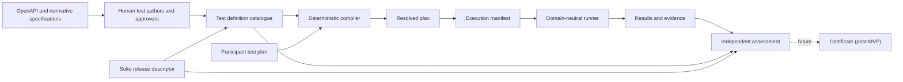

# Test Plan Architecture Migration Guide

> **Status: Accepted architecture record**
>
> **Decision date:** 2026-09-14
>
> **Architecture correction:** 2026-09-16 (`TPA-084` through `TPA-089`)
>
> This document is authoritative for the migration boundaries and decisions
> marked **Accepted** below. Items marked **Deferred**, **Superseded**, or
> **Compatibility only** are not part of the replacement architecture.

## Purpose

The conformance suite will migrate towards explicit, configuration-driven
artefacts with stable schemas and end-to-end traceability.

The governing principle is:

> Human-authored test definitions, participant intent, compilation, execution,
> and assessment are separate concerns.

The runner executes an immutable manifest produced by a compiler. It does not
infer Open Banking obligations. The compiler resolves a participant plan
against an approved, human-authored test catalogue. Normative specifications
inform human test design and review; they are not transcribed into a
machine-readable requirements authority used by the runtime or validator.

This is a strangler migration. Existing behaviour is characterised before it
is replaced, new contracts are introduced alongside current code, one vertical
slice proves the architecture, consumers move behind compatibility adapters,
and superseded structures are removed last.

## Decision status

The status terms in this document have precise meanings:

| Status | Meaning |
| --- | --- |
| **Accepted** | Binding for the migration. A later change requires an explicit superseding decision. |
| **Deferred** | Intentionally undecided and owned by a named later layer. It must not be inferred by an earlier layer. |
| **Superseded** | Considered and rejected as a direction for the replacement architecture. |
| **Compatibility only** | Existing behaviour to characterise, not an accepted replacement contract or a promise to preserve it. |

## Terminology

| Term | Meaning |
| --- | --- |
| **Suite release descriptor** | OBL-authored document that binds compatible released configuration artefacts, schemas, catalogues, tool releases, and content hashes. |
| **Requirements catalogue** | Superseded runtime concept. Normative requirements may be explained in reviewer-facing documentation but are not a machine-readable configuration or certification authority. |
| **Test definition catalogue** | Human-authored and human-approved reusable test cases, request bindings, assertions, dependencies, inputs, and applicability. It is not generated directly from a specification. |
| **Participant test plan** | Participant intent: target release, declared implementation scope, environment configuration, and values for predefined inputs. |
| **Resolved plan** | Generated, inspectable explanation of how a participant plan was resolved against the approved test catalogue. |
| **Execution manifest** | Generated, immutable, runner-facing instructions containing only resolved executable work. |
| **Result and evidence** | Runner-generated observations, outcomes, safe evidence, and traceability identifiers. |
| **Certification assessment** | Independently calculated evaluation of approved-test completeness, outcomes, and eligibility against the suite release and release policy. It is not an automated judgement over every normative specification requirement. |
| **Certificate** | Formal business artefact produced by the certification process; not an MVP runtime output. |
| **Security profile** | A protocol security profile such as FAPI 1 Advanced. In the current `1.0` plan, `specification.profile` has only this meaning. |
| **Test scope** | The released functional scope against which the approved test catalogue resolves applicability. AIS, PIS, CBPII, and VRP are currently exposed as resource/API families, not silently redefined as security profiles. Existing `requirementsScope` wire names are migration debt, not authority for a requirements catalogue. |

Names used for target concepts in this document are architectural terms, not
accepted JSON property names unless a later schema decision says otherwise.

> **Current authority:** `TPA-084` through `TPA-089` supersede every earlier
> clause that makes a machine-readable requirements catalogue, normative
> requirement applicability, or requirement-level coverage part of the target
> runtime or certification assessment. Earlier entries remain below as
> migration history and must not be used to reintroduce those concepts.
>
> Decisions `TPA-001` through `TPA-083` record the architecture accepted and
> implemented at each migration stage. Where their wording conflicts with
> `TPA-084` through `TPA-089`, that wording is **Superseded**, not current
> implementation guidance.

## Architecture decision history

The following decisions remain binding except where the current-authority note
above or a later decision explicitly supersedes them.

| ID | Decision | Rationale |
| --- | --- | --- |
| `TPA-001` | Requirements, participant intent, test definitions, resolved compilation, execution, results, and assessment are separate concerns and artefacts. | Prevents participant input, test implementation, and certification policy from becoming one mutable source of truth. |
| `TPA-002` | Requirements catalogues and test definition catalogues are separate. | A requirement is not a test; each side has different authorship, review, versioning, and reuse needs. |
| `TPA-003` | Participant-authored plans and generated execution manifests are separate. Participants do not author or edit resolved plans or execution manifests. | Prevents bypassing requirements validation and preserves provenance. |
| `TPA-004` | The runner is domain-neutral with respect to Open Banking obligation logic. | Obligation, applicability, and selection rules belong in trusted catalogues and the compiler. |
| `TPA-005` | Requirements are immutable within a selected suite release. Validation or a future execution policy may report or tolerate a participant-plan violation, but cannot weaken the requirement. | Keeps certification meaning stable and auditable. |
| `TPA-006` | OpenAPI is authoritative for the technical operation inventory, not for normative obligation. | OpenAPI supplies methods, paths, operation IDs, schemas, parameters, and security schemes; Standards-owned catalogues supply mandatory, conditional, and optional rules. |
| `TPA-007` | Every important object has a stable identifier, and coverage relationships are explicit. | Names and ordering are insufficient for durable requirement-to-evidence traceability. |
| `TPA-008` | Every new JSON artefact is versioned, strictly schema-validated, semantically validated, deterministic, and serialisable. Unknown properties fail unless the schema explicitly defines an extension point. | Avoids ambiguous configuration and makes fixtures, audit, and migration repeatable. |
| `TPA-009` | External JSON Schema is the structural authority for each new document version. Typed Python loading occurs only after structural validation and must not independently maintain duplicate structural rules. Cross-document and domain rules belong to semantic validators with stable diagnostics. | Establishes one schema authority while preserving typed runtime code. |
| `TPA-010` | New stable IDs are opaque ASCII identifiers, unique within their declared object kind and suite-release namespace. IDs must not be derived from display labels or array positions and must not be reused for changed semantics. | Supports stable references without making filenames or presentation text part of identity. |
| `TPA-011` | Suite release descriptors bind referenced artefacts by media type, schema version, logical ID, and `sha256:<lowercase-hex>` digest of the exact versioned bytes. A descriptor does not hash itself. | Makes release inputs deterministic and independently verifiable without a self-reference cycle. |
| `TPA-012` | Logical input ownership is split: requirements define which inputs are permitted or required; test definitions define technical request bindings; participant plans supply values; compilation records resolution. | Keeps test implementation details out of normative requirements and arbitrary request editing out of participant plans. |
| `TPA-013` | Requirements rules begin as a small, explicit, typed vocabulary. A general expression language is not introduced without concrete specification cases and a superseding decision. | Keeps validation reviewable and avoids premature language design. |
| `TPA-014` | Plan validity, permission to compile or execute, certification eligibility, individual test outcome, and overall conformance assessment are distinct facts. | A selected test can pass while the run remains incomplete or ineligible; an incomplete developer run is not automatically non-conformant. |
| `TPA-015` | Compiler output explains every inferred or explicit selection, applied rule, default, dependency, finding, suite release, and released configuration artefact. Under the same tool release, equivalent participant inputs and suite-release artefact bytes produce equivalent output apart from explicitly declared runtime-generated values. | Makes generated scope reviewable and reproducible without making migration baselines production inputs. |
| `TPA-016` | The execution manifest contains resolved work only: exact instances and steps, order and dependencies, resolved input instructions, protocol/authentication instructions, assertions, evidence policy, and immutable references to the suite release and released configuration artefacts. | Keeps participant grammar, UI concepts, obligation logic, and legacy comparison sources out of the runner. |
| `TPA-017` | Results carry the stable traceability chain from requirement to test definition, compiled instance, manifest step, and result observation. | Allows evidence and independent assessment to be tied back to trusted sources. |
| `TPA-018` | Certification assessment remains independent of participant-controlled compilation and execution inputs and uses trusted requirements plus approved-release policy. Certificate generation is deferred beyond MVP. | Preserves the current assurance boundary and avoids presenting local output as a formal certification decision. |
| `TPA-019` | Sensitive values never enter resolved-plan trace snapshots, execution-manifest traceability, persisted evidence, or safe exports. | Traceability must not create a credential disclosure path. |
| `TPA-020` | Existing behaviour is characterised before replacement; one representative vertical slice proves shared contracts before catalogue-family migration; legacy structures are deleted only after their consumers move. | Keeps every migration layer reviewable and the system operational. |
| `TPA-021` | The first walking skeleton is the Open Banking Read/Write v4.0 domestic standing-order flow: consent creation and retrieval, payment submission and retrieval, its dependency chain, and the predefined frequency input. Valid and invalid frequency fixtures are both required. | Exercises conditional scope, multiple endpoints, dependencies, reusable input binding, and positive/negative validation without migrating all PIS content. |
| `TPA-022` | Existing parity contracts remain pinned migration-verification baselines until an explicit, reviewed compatibility decision replaces a behaviour. Each replacement catalogue is authored in the new model and compared against the applicable parity contract before release; parity contracts and their legacy source files are not production suite artefacts or runtime dependencies. | Prevents the migration from silently dropping or normalising legacy coverage without permanently coupling the replacement architecture to legacy inputs. |
| `TPA-023` | The MVP support matrix includes the complete AIS, PIS, CBPII, and VRP API families for both Open Banking Read/Write v3.1.11 and v4.0.1, plus Dynamic Client Registration v3.4. Migration layers must preserve the whole matrix even when one representative walking skeleton proves a new contract. | Separates the deliberately narrow implementation slice used to prove architecture from the product versions and API families that must remain fully supported. |

### Stable traceability chain

```text
approved suite release
    |
    | pins
    v
test definition ID
    |
    | selected and instantiated by compilation
    v
compiled test instance ID
    |
    | rendered as executable work
    v
manifest step ID
    |
    | produces
    v
result observation ID
```

Every assessed result must trace to a test definition pinned by the approved
suite release. Specification-to-test rationale may be maintained in
reviewer-facing documentation, but it is not a runtime coverage edge and is not
used by the validator to claim assessment of a normative requirement.

## Artefact ownership and authority

| Artefact | Author/producer | Authority and responsibility |
| --- | --- | --- |
| Suite release descriptor | OBL release owner | Selects compatible, immutable input artefacts and records exact digests. It does not define requirement or test semantics itself. |
| Test definition catalogue | Test authors and approvers | Human-authored authority for executable cases, request bindings, assertions, dependencies, inputs, and applicability. It is reviewed against the relevant specifications but is not generated from them. |
| Participant test plan | Participant or builder | Authoritative only for participant intent and supplied values. It cannot redefine approved executable test definitions. |
| Resolved plan | Compiler | Authoritative record of resolution for one compilation. It is generated, inspectable, deterministic, and not participant-editable. |
| Execution manifest | Compiler | Authoritative runner input for one execution. It contains resolved instructions and immutable suite-release and configuration traceability, not unresolved domain rules or legacy comparison inputs. |
| Results/evidence | Runner | Authoritative record of observations made during that execution. It does not decide approved-test completeness by itself. |
| Certification assessment | Trusted validator | Authoritative assessment of approved-test completeness, outcomes, and eligibility against the approved suite release and release policy. |
| Certificate | Certification process | Formal business decision and artefact, deferred beyond MVP. |

Schema authority is per document version. The external schema owns structural
shape and constraints. Python loaders map a schema-valid document into immutable
types. Semantic validators own rules that require domain knowledge,
cross-document references, or comparison of values. A constraint must not be
implemented independently in both layers merely for convenience.

### PR 2 shared contract decisions

The first shared contract version is implemented under
`conformance/configuration_contracts/`. These names and wire rules are accepted
for the shared foundation:

| ID | Decision | Rationale |
| --- | --- | --- |
| `TPA-024` | Shared external schemas use canonical HTTPS `$id` values under `https://schemas.openbanking.org.uk/conformance/v1/` and are bundled under `configuration_contracts/schemas/v1/`. The initial document `schemaVersion` is `1.0`. | Canonical identifiers make references independent of checkout paths while versioned bundled files keep validation deterministic and offline. |
| `TPA-025` | Every shared document envelope has `schemaVersion`, `documentType`, and opaque stable `id`. Stable IDs are lowercase ASCII matching `[a-z0-9][a-z0-9._:-]*`, limited to 128 characters, and scoped to object kind and suite release. | Establishes minimum versioning, dispatch, and identity without deriving identity from names or ordering. Lowercase-only IDs avoid case-normalization ambiguity across tools and filesystems. |
| `TPA-026` | Provenance is document-specific derivation metadata, not a mandatory common-envelope field. When a document has a genuine derivation use case, its owning schema defines the required source metadata. Exact SHA-256 digests are required only for artefacts bound by a suite-release descriptor. | Avoids speculative provenance fields and prevents parity-comparison inputs from becoming production dependencies while retaining exact release-byte integrity. |
| `TPA-027` | A `suite-release` `1.0` descriptor adds `releaseVersion`, RFC 3339 `publishedAt`, compatible `toolReleases`, and content-addressed `artifacts`. Each artefact records stable `id`, `kind`, `mediaType`, `schemaVersion`, normalized bundle-relative `uri`, and exact-byte digest. Paths are confined to the release-bundle root and cannot contain absolute, empty, `.` or `..` segments. The descriptor never hashes itself. Canonical schema `$id` values remain absolute HTTPS URIs. | Implements deterministic local release binding without coupling artefact identity to a source checkout or permitting remote retrieval. |
| `TPA-028` | Configuration failures use immutable diagnostics with stable dotted codes, severity, RFC 6901 `instance_path`, optional `schema_path`, and human-readable message. Schema, semantic uniqueness, unresolved artefact, and digest failures retain distinct codes. | Callers can automate on codes and paths without parsing library-dependent prose. |
| `TPA-029` | Python models are frozen, slotted types created only after external schema validation. Python performs only cross-item ID uniqueness and supplied-byte digest checks in this layer; it does not repeat structural schema constraints. | Preserves one structural authority and prevents mutable parsed configuration from leaking into later compilation or execution. |

The `suite-release` fixture in PR 2 binds only the shared schemas. It is contract
evidence, not a product release descriptor and not catalogue content. Current
builder, canonical plan, compiler, executor, catalogues, result formats, and
approved-release policy remain unchanged. The foundation verifies caller-supplied
bytes keyed by artefact kind and ID; a later packaging adapter may resolve
bundle-relative paths, but the shared validator does not open filesystem paths.

### PR 3 walking-skeleton decisions

The first requirements and test-definition catalogues are an illustrative,
strict Read/Write v4.0 PIS domestic-standing-order bundle. They prove the
contract boundary without replacing the current executable PIS catalogue:

| ID | Decision | Rationale |
| --- | --- | --- |
| `TPA-030` | `requirements-catalogue` and `test-definition-catalogue` are separate `1.0` documents. The test catalogue names its requirements catalogue, and semantic validation resolves every capability, endpoint, predefined-input, requirement, normative-reference, and test-dependency ID. | Makes authorship and authority boundaries enforceable while retaining explicit cross-document traceability. |
| `TPA-031` | The initial requirements-rule vocabulary has one rule, `required-when-capability-selected`, whose target is either an `endpoint` or `predefined-input`. The domestic-standing-order capability is `conditional`; selecting it requires its four OpenAPI operations and frequency input. | Proves conditional scope with an explicit typed rule and avoids inventing a general expression language or unsupported cardinality semantics. |
| `TPA-032` | Endpoint entries record the exact OpenAPI method, relative path, and operation ID, while requirements separately cite stable normative-reference entries. Legacy FCS rows and parity artefacts are not normative references or production bundle inputs. | Preserves the distinction between technical operation inventory, normative obligation, and migration evidence. |
| `TPA-033` | `pis.dso.input.frequency` is a non-sensitive logical input with a narrow `standing-order-frequency-v4` shape. Its logical camel-case fields are not request paths. Consent creation and payment submission test definitions independently bind it to the request body with the `pis-v4-standing-order-frequency` transform and an RFC 6901 target. | Demonstrates shared logical input ownership without exposing arbitrary participant request overrides or placing technical bindings in requirements. |
| `TPA-034` | Every test definition has at least one explicit covered requirement ID. The four-test consent-create, consent-read, order-create, order-read chain is a directed acyclic dependency graph; missing dependencies and cycles are invalid configuration. | Provides deterministic reusable test ordering and prevents requirement coverage from being inferred from names. |
| `TPA-035` | The walking-skeleton suite descriptor binds the exact requirement schema, test-definition schema, requirements catalogue, and test-definition catalogue bytes. It is an illustrative contract bundle, not an approved product release, and is not registered with the current runtime. | Proves immutable release binding while preserving the characterised builder, compiler, executor, results, and assessment paths for later migration layers. |

This slice deliberately leaves several model gaps visible. Broader capability
dependencies, mutual exclusion and cardinality, condition types other than
capability selection, reusable input types beyond v4 standing-order frequency,
request-template composition, assertion vocabularies beyond HTTP status, and
full normative PIS coverage require evidence from later slices. Participant
values, defaults, and resolved compilation are introduced by PR 4;
execution-manifest rendering and broader runtime adapters remain owned by PR 5.
The current frequency shape enforces the v4 code list and rejects simultaneous
`countPerPeriod` and `pointInTime`; it does not claim to encode every
type-dependent semantic rule not expressed by the source OpenAPI schema.

### PR 4 participant-plan and resolved-compiler decisions

| ID | Decision | Rationale |
| --- | --- | --- |
| `TPA-036` | The walking-skeleton `participant-plan` `1.0` names one suite release, scheme, specification/version/requirements scope, security profile, conditional capability IDs, and predefined logical input values. It has no test-selection, endpoint-selection, request-override, assertion-override, or developer-mode syntax. | Keeps participant intent smaller than generated scope and prevents bypassing immutable requirements or reusable test definitions. Existing environment and credential configuration remains at the compatibility boundary until participant-surface migration. |
| `TPA-037` | Compilation applies only the accepted `required-when-capability-selected` rule. A strict walking-skeleton plan selects at least one conditional capability, which infers its endpoint and predefined-input requirements. Non-empty scope, array uniqueness, and exactly one value per input ID are the only cardinalities evaluated in this slice; general mutual-exclusion and cardinality rules remain deferred under `TPA-031`. | Implements the accepted walking skeleton without silently inventing the deferred generic rule vocabulary. |
| `TPA-038` | `resolved-plan` `1.0` records explicit and inferred scope, applicable requirements and normative references, resolved non-sensitive input values and their participant/default source, topologically ordered test instances, dependency edges, stable inclusion reasons, findings, and the complete suite-release artefact/tool provenance. Its deterministic ID is a SHA-256 digest over normalized participant intent and the immutable compiler inputs. | Makes every inclusion and source inspectable while ensuring equivalent order-insensitive participant selections compile identically. |
| `TPA-039` | The resolver always constructs inspectable output. The strict MVP compiler raises `ParticipantPlanCompilationError` when that output contains an error finding and exposes the invalid resolved plan on the exception. Stable findings name their source document and cover empty scope, release/specification mismatch, unknown or inapplicable selections, missing inputs, unsupported rules, and uncovered applicable requirements. | Preserves unambiguous diagnostics for review and audit without allowing an invalid MVP plan to reach execution. This is not a developer-mode enforcement policy. |
| `TPA-040` | `AdaptedCompiledExecution` maps only the four accepted test-definition IDs to existing v4 PIS cases, compiles the unmodified legacy catalogue, explicitly deselects additional optional legacy work so it remains visible in traceability, and returns the translated runtime-input mapping alongside the `CompiledTestPlan`. Existing environment, credential, and non-frequency business values remain explicit adapter inputs. The adapter rejects mandatory unmapped work or frequency shapes the current runtime cannot render rather than weakening or silently changing either source plan. | Proves the new compiler can feed the characterised runtime without replacing consumers, hiding legacy applicability, or leaking legacy test IDs and input names into the new participant/resolved contracts. Broader execution rendering remains PR 5. |

### PR 5 execution-manifest decisions

| ID | Decision | Rationale |
| --- | --- | --- |
| `TPA-041` | `execution-manifest` `1.0` is a generated, immutable, schema-validated document. It contains ordered step and dependency IDs, test-instance and test-definition IDs, covered requirement IDs, exact endpoint methods and relative paths, resolved logical inputs and bindings, HTTP-status assertions, masked request/response evidence instructions, and copied suite/resolved-plan provenance. Its content-addressed ID is a SHA-256 digest over the canonical document without the ID field. | Gives the runner a deterministic contract containing resolved work and traceability without participant selection grammar, requirement rules, UI state, or certification inference. |
| `TPA-042` | The walking-skeleton manifest supports only non-sensitive `standing-order-frequency-v4` inputs, `GET`/`POST` requests, `json-body` bindings, and `http-status` assertions. A redacted required value, unresolved reference, dependency that does not precede its consumer, or unsupported shape blocks manifest generation or loading. | Keeps the first runtime vocabulary strict and evidence-driven instead of prematurely generalising from one PIS slice. |
| `TPA-043` | `PreparedExecutionManifest` is an internal compatibility binding, not a serialised configuration artefact. For the walking skeleton it pairs the stable manifest with the existing `CompiledTestPlan`, translated runtime values, and file-reference base directory. Existing participant surfaces without resolved plans are wrapped with `manifest=None` until PR 8. | Separates the durable runner contract from temporary legacy state while allowing all current launch paths to cross the same executor boundary. |
| `TPA-044` | `run_execution_manifest` dispatches explicitly to the unchanged Read/Write synthetic-manifest machinery or DCR catalogue adapter. `run_compiled_test_plan` remains as a compatibility entry point that constructs this binding first. No HTTP, OAuth, PSU, JWS, scheduling, masking, evidence, or result semantics move into the new configuration contract. | Preserves characterised behaviour and makes both legacy paths visible and removable without presenting either implementation as the target manifest model. |

## Target flow



## Validity, execution, eligibility, and outcome

| Question | Concept |
| --- | --- |
| Can participant intent be resolved to an applicable approved test set? | Plan or selection validity |
| May this selection be compiled and run under the active policy? | Compilation/execution permission |
| Could the evidence contribute to a certification submission? | Certification eligibility |
| Did an executable test produce its expected outcome? | Test outcome |
| Did the complete applicable approved test set finish successfully? | Overall automated assessment |

The accepted internal meanings are:

- **Certification-eligible**: the run has the required scope and evidence
  conditions to contribute to certification.
- **Not certification-eligible**: the run cannot support certification.
- **Conformant**: a complete eligible automated assessment passed its
  applicable approved tests. This does not claim that the tool assessed every
  normative specification requirement.
- **Non-conformant**: an applicable approved test failed.
- **Not assessed overall**: insufficient applicable scope was executed to make
  an overall automated judgement.
- **Passed**, **failed**, **skipped**, and **warned**: individual test or step
  outcomes.

Public product wording must continue to use **certification-ready** or
**locally validated**, not **certified**, unless the formal certification
process owns the statement.

## Compatibility decisions

These decisions describe how the migration treats the current system. They do
not promote current implementation details into target architecture.

| ID | Status | Current behaviour | Migration treatment |
| --- | --- | --- | --- |
| `TPC-001` | Compatibility only | `PlanDocumentV2` is the current participant-facing canonical JSON plan. | PR 1 characterises it. A later participant-plan layer decides adaptation and cutover. The `V2` Python name is not reserved as a target artefact name. |
| `TPC-002` | Compatibility only | `CANONICAL_TEST_PLAN_JSON_SCHEMA` is inline Python and some business data is structurally open. | It remains authoritative for current schema version `1.0`. PR 2 introduces external schema infrastructure for new document versions without silently changing `1.0`. |
| `TPC-003` | Compatibility only | `specification.profile` means a FAPI security profile. | Preserve that meaning while `1.0` is supported. It must not be reused for functional or requirements scope. Any new field name belongs to the participant-plan schema layer. |
| `TPC-004` | Deferred compatibility decision | Participant plans currently accept `executionMode` values `certification` and `development`. | This is an existing legacy field, not an accepted replacement concept. PR 1 characterises it. The later layer that owns execution policy decides whether to adapt, deprecate, or remove it. PR 0 makes no preservation promise. |
| `TPC-005` | Compatibility only | Read/Write execution adapts `CompiledTestPlan` into a synthetic legacy `Manifest`; DCR uses a separate adapter. | PR 5 must preserve observable behaviour through explicit adapters before either path can be removed. |
| `TPC-006` | Accepted risk boundary | Phase 1 reports are produced in participant-controlled environments and cannot prove authenticity. | Independent validation can establish consistency and readiness, not tamper resistance or formal certification. OBL-controlled provenance remains a Phase 2 concern. |
| `TPC-007` | Accepted corrections | The versioned Read/Write and DCR parity contracts list deliberate corrections to legacy behaviour. | Those ledgers are authoritative compatibility decisions. Unlisted observable deltas remain release blockers. |

## Deferred decisions and ownership

Deferred items are deliberately unavailable to earlier layers. An owning PR
must record the final decision before implementing the affected contract.

| ID | Deferred decision | Owning layer |
| --- | --- | --- |
| `TPD-001` | Final filenames and JSON property names not fixed by this record. | PR 2 for shared envelopes; PR 3-6 for their owned artefacts. |
| `TPD-002` | Exact typed requirements-rule wire vocabulary beyond the accepted small explicit rule set. | PR 3, proven by the standing-order skeleton. |
| `TPD-003` | Physical catalogue file partitioning. | PR 3, while preserving logical ownership and suite-release binding. |
| `TPD-004` | Exact participant-plan representation of requirements scope. | PR 4. It must not overload `specification.profile`. |
| `TPD-005` | Resolved-plan storage lifetime and participant-facing presentation. | PR 4 defines serialization; PR 8 owns participant surfaces. |
| `TPD-006` | Exact execution-manifest schema and runtime-generated instruction vocabulary. | Resolved for the walking skeleton by `TPA-041` through `TPA-044`; broader protocol vocabulary remains owned by each catalogue-family migration. |
| `TPD-007` | Final public assessment terminology beyond the existing certification-ready assurance boundary. | PR 6 with Product, Standards, and Certification review. |
| `TPD-008` | Backwards-compatibility duration and removal policy for current plans, results, and adapters. | The layer changing each public surface; final removals in PR 9. |
| `TPD-009` | Whether any future developer policy can permit compilation of invalid partial selections, and where that policy is requested. | Post-MVP architecture decision. |
| `TPD-010` | Certificate generation, signing, and issuance. | Post-MVP certification process. |

## Superseded proposals

The following proposals are not accepted and must not appear in earlier
migration layers:

- participant-authored or participant-editable execution manifests;
- arbitrary participant `requestOverrides` or JSON Pointer request editing;
- a `developmentOverrides` object;
- disabling or mutating requirements in developer mode;
- reusing `specification.profile` for a functional requirements scope;
- a generic expression language before explicit rule forms prove insufficient;
- deriving stable IDs from display labels, filenames, or array order;
- inferring requirement coverage from test names;
- treating an incomplete developer run as proof of non-conformance; and
- treating a locally generated passing report as an automated certification
  decision or proof of authenticity.

## Historical migration sequence

This sequence records how the current implementation was built. It is not the
plan for the catalogue-consolidation correction introduced by `TPA-084`
through `TPA-089`. In particular, references below to creating, loading, or
assessing requirements catalogues describe implemented migration history, not
new target work.

### PR 0: architecture record

This document is the deliverable. No replacement code, schema, or catalogue
content belongs in this layer.

Exit gate:

- artefact responsibilities and authorities are explicit;
- accepted, compatibility-only, deferred, and superseded decisions are
  distinguishable;
- terminology collisions are recorded; and
- developer-mode and certificate concerns are explicitly deferred.

### PR 1: current pipeline characterisation

Add golden tests without changing production behaviour. Freeze representative
participant-plan parsing, catalogue selection, endpoint/capability
applicability, dependency expansion, business-data mapping, synthetic manifest
generation, result traceability, and eligibility. Cover the accepted PIS
standing-order journey plus representative AIS and DCR paths. Record suspicious
behaviour as compatibility findings rather than normalising it.

### PR 2: shared configuration contracts

Introduce versioned external schemas, common document envelopes, stable IDs,
immutable typed loading, structured diagnostics with stable codes and instance
paths, document-specific provenance where justified, and suite-release metadata.
Do not migrate current consumers or catalogue content.

### PR 3: requirements and test-definition walking skeleton

Model only the accepted Read/Write v4.0 domestic standing-order slice. Keep
requirements and tests separate, give every test explicit covered requirement
IDs, separate logical inputs from request bindings, and validate references.
Preserve the current runtime path.

### PR 4: participant plan and resolved compiler

Introduce the new participant-plan contract and deterministic resolved-plan
compiler for the walking skeleton. Infer required scope, evaluate the accepted
typed rules, resolve predefined inputs, expand dependencies, preserve findings
and suite-release traceability, and adapt to the current compiled execution
path. Do not add developer-mode selection or override syntax.

### PR 5: execution-manifest boundary

Generate an immutable execution manifest from the resolved plan and adapt the
existing runtime to consume it. Do not redesign HTTP, OAuth, PSU, JWS,
scheduling, or evidence behaviour. Preserve Read/Write and DCR through explicit
compatibility adapters.

### PR 6: result and assessment traceability

Connect results to suite release, requirements, test definitions, compiled
instances, manifest steps, safe participant-plan snapshot, and compiler
findings. Keep independent certification assessment and do not implement
certificate generation.

Compatibility decision: reports produced through the stable execution-manifest
boundary add a top-level `traceability` block. Existing smoke-check, legacy
manifest, compiled-catalogue, and DCR report shapes remain unchanged until
their participant surfaces migrate. Stable manifest steps identify their
current result observations explicitly; observations emitted only by the
legacy OAuth/PSU compatibility engine are listed separately as compatibility
observations rather than misrepresented as normative test definitions.
Participant input values are copied only when the trusted requirements
catalogue classifies them as non-sensitive.

### PR 7: catalogue-family migration

After the contracts and walking skeleton are accepted, migrate PIS, AIS,
CBPII, VRP, and DCR independently. Family work owns only its catalogue
directory and fixtures. A coordinator-owned change integrates the central
release registry. Each replacement catalogue is authored independently of the
legacy manifests and parity contracts, then must pass a deterministic
comparison against its pinned parity baseline before its release is accepted.
The comparison report is release-gate evidence, not a production input.
The coordinator-owned registry is the content-addressed
`conformance/configuration_contracts/bundles/open-banking-mvp/suite-release.json`
descriptor. It binds the complete accepted matrix and its schema and technical
source artefacts without exposing participant-facing selection behaviour owned
by PR 8.

The PIS family migration accepts these additional decisions:

| ID | Decision | Rationale |
| --- | --- | --- |
| `TPA-045` | PIS has independent requirements and test-definition catalogues for the accepted Read/Write `3.1.11` and `4.0.1` versions. Each catalogue declares five participant-selectable MVP payment capabilities and the 21 exact OpenAPI operations needed by those journeys. File payments, international standing orders, and payment-detail operations remain outside the accepted MVP capability scope and are not represented as tested requirements. | Prevents a partial conformance suite from claiming coverage of every operation exposed by the source OpenAPI document while preserving the complete accepted PIS MVP surface. |
| `TPA-046` | Requirements catalogues bind endpoints to a content-addressed technical source and exact JSON Pointer. Test definitions use generic positive, negative, and security purposes; request modifications; and HTTP-status, response-schema, header-presence, and JSON-value assertions. String and structured frequency inputs are distinct typed values so v3.1.11 and v4.0.1 retain their authoritative request shapes. | Expands the shared vocabulary from evidence in both accepted specifications without importing legacy request builders or identifiers into the target contracts. |
| `TPA-047` | Pinned v3.1 and v4 legacy PIS rows are comparison-only fixtures. Every row is classified and names replacement test-definition IDs. The one intentional correction rejects invalid standing-order frequency at consent staging instead of constructing a submission from an invalid authorised consent; no pinned row is a genuine omission. | Makes retained coverage and intentional semantic change reviewable while keeping parity evidence out of production compilation and execution. |
| `TPA-048` | PIS family fixtures include referential-integrity failure evidence and deterministic participant-to-resolved-plan goldens for both accepted versions. Test-only suite descriptors bind catalogue bytes but are not central registry entries or approved releases. | Proves the family artefacts compile reproducibly without coupling this PR to coordinator-owned release registration. |

The VRP family migration accepts these additional decisions:

| ID | Decision | Rationale |
| --- | --- | --- |
| `TPA-049` | VRP has independent requirements and test-definition catalogues for the accepted Read/Write `3.1.11` and `4.0.1` versions. The v3.1.11 catalogue binds all seven VRP OpenAPI operations. The v4.0.1 catalogue binds all nine operations, with funds confirmation and the standards-version migration `PUT` and `PATCH` operations represented as separately selectable capabilities. | Preserves the complete accepted VRP operation surface without presenting explicitly optional or conditional operations as unconditional core support. |
| `TPA-050` | Capabilities may declare acyclic `requiredCapabilityIds`. Compilation closes this dependency graph deterministically and records prerequisite capabilities as inferred. Requirements scope is a generic stable identifier, and the shared HTTP vocabulary includes `DELETE`, `PUT`, and `PATCH` alongside `GET` and `POST`. | VRP optional operations depend on the domestic consent/payment lifecycle, and the operation inventory requires methods not exercised by the PIS walking skeleton. These are generic contract concepts rather than VRP-specific runtime behavior. |
| `TPA-051` | VRP requirements own the non-sensitive configurable request values used for consent limits, creditor account data, instructed amounts, currency, and validity dates. Test definitions own their JSON-body bindings, generated payment identifiers, exact success/error statuses, response schemas, resource-status assertions, and dependency order. | Keeps participant values distinct from executable request construction while retaining the authoritative v3.1.11 and v4.0.1 wire shapes. |
| `TPA-052` | Pinned VRP rows are comparison-only fixtures. Pre-3.1.11 variants and the repeated-delete row that accepted either success or failure are classified as obsolete behavior. All remaining rows map to replacement test definitions, and no row is a genuine omission. | Avoids promoting version-obsolete bodies or a non-deterministic legacy assertion into the target contract while making every parity difference explicit. |
| `TPA-053` | VRP family fixtures include capability-dependency and cross-catalogue referential-integrity failures plus deterministic participant-to-resolved-plan goldens for both accepted versions. Test-only suite descriptors bind catalogue bytes but are not central registry entries or approved releases. | Proves deterministic selection, dependency inference, and compilation while preserving the coordinator-owned registry boundary. |

The CBPII family migration accepts these additional decisions:

| ID | Decision | Rationale |
| --- | --- | --- |
| `TPA-054` | CBPII has independent requirements and test-definition catalogues for the accepted Read/Write `3.1.11` and `4.0.1` versions. Each catalogue exposes one participant-selectable confirmation-of-funds capability requiring the four exact OpenAPI operations for consent creation, consent retrieval, consent deletion, and funds confirmation. | Models the normative CBPII journey without promoting the legacy catalogue's endpoint-scoped implementation capabilities into the replacement contract. |
| `TPA-055` | The shared configuration vocabulary supports generic functional requirement scopes, `DELETE` operations, sensitive predefined inputs, and path-parameter request modifications. CBPII uses string inputs for debtor-account scheme and identification plus instructed amount and currency; sensitive account identification is redacted in resolved plans. | Adds only cross-family protocol and data concepts demonstrated by the authoritative CBPII sources while preserving the existing schema-authoritative loading and compiler boundary. |
| `TPA-056` | Each accepted CBPII version has 13 source-authored test definitions covering success, schema constraints, consent deletion, supported ISO 8601 expiration forms, and removal of the obsolete `x-fapi-financial-id` request header. Pinned legacy rows remain comparison-only; the duplicate legacy `000009` identifier and OpenAPI response-schema checks added to the four expiration-format cases are recorded as intentional corrections, and no row is a genuine omission. | Retains observable standards coverage, explicitly records standards-derived hardening, and avoids treating legacy identifiers, request construction, setup flags, or manifest structure as target contracts. |
| `TPA-057` | CBPII family fixtures include exact OpenAPI source binding, referential-integrity failure evidence, sensitive-value redaction, and deterministic participant-to-resolved-plan goldens for both accepted versions. Their suite descriptors are test-only and are not central registry entries. | Proves reproducible family compilation while leaving coordinator-owned release registration separate. |

The AIS family migration accepts these additional decisions:

| ID | Decision | Rationale |
| --- | --- | --- |
| `TPA-058` | AIS has independent requirements and test-definition catalogues for Read/Write `3.1.11` and `4.0.1`. Each catalogue exposes 12 participant-selectable resource capabilities and all 29 operations from the matching Account Information OpenAPI document. Resource capabilities explicitly depend on account-access consent, and non-account resources also depend on account discovery. | Preserves the profile's consent-first flow and requirement that `GET /accounts` is the first resource call without encoding those dependencies in array order, legacy setup cases, or runner behavior. |
| `TPA-059` | The shared vocabulary adds timezone-aware and timezone-less ISO 8601 date-time inputs, query-parameter input bindings, authorization request generation, multi-status HTTP assertions, and response-header equality with the originating request. v3.1.11 transaction filters use RFC 3339 values; v4.0.1 uses the specification's timezone-less form. These forms build on the generic capability-dependency, HTTP-method, and path-modification vocabulary and are carried unchanged into generated execution manifests. | AIS provides concrete specification cases that the existing family vocabulary could not represent: version-specific transaction date filters, consent-bound permission contexts, specification-permitted alternative error statuses, and `x-fapi-interaction-id` playback. |
| `TPA-060` | AIS requirements bind every endpoint to the content-addressed OpenAPI operation and cite the Account and Transaction API Profile for consent, permission, authorization, and request-order obligations. Predefined transaction date inputs remain logical participant values; test definitions own their query-parameter bindings. | Keeps OpenAPI technical inventory, normative obligations, participant intent, and executable request construction separate while retaining exact traceability to both authoritative sources. |
| `TPA-061` | The pinned v3.1 and v4 AIS rows remain comparison-only fixtures. The legacy singular `/product` request is an intentional correction to the authoritative `/products` operation, the synthetic `/foobar` probe is obsolete non-operation behavior, and every other row maps to retained replacement coverage; neither baseline is a runtime dependency. Referential-integrity, capability-cycle, deterministic compilation, and manifest round-trip fixtures cover both versions without central registry entries. | Makes the two deliberate differences explicit, demonstrates that no pinned row is a genuine omission, and preserves the coordinator-owned registry boundary. |

The DCR family migration accepts these additional decisions:

| ID | Decision | Rationale |
| --- | --- | --- |
| `TPA-062` | Dynamic Client Registration is independently versioned. The accepted MVP matrix remains Read/Write `3.1.11` and `4.0.1` plus DCR `3.4`; the DCR catalogue does not claim an unsupported normative mapping to either Read/Write release. | The Read/Write profiles require ASPSP registration but publish no DCR compatibility matrix. Chronological release proximity is not sufficient authority for a cross-standard version binding. |
| `TPA-063` | DCR 3.4 exposes one conditional registration capability and three optional management capabilities. Management tests depend on a reusable positive registration setup without selecting the registration capability or its negative-test assessment scope. All four operations bind directly to the pinned DCR 3.4 OpenAPI; `operationId` is absent because the authoritative source defines none. | Corrects the legacy participant-plan contract that made POST mandatory and invented operation identifiers, while keeping assessment scope separate from generated setup. |
| `TPA-064` | Generic catalogue vocabulary supports `PUT` and `DELETE`, source operations without an `operationId`, empty predefined-input collections, DCR's `all` security-profile boundary, request content type, transport and authorization profiles, whole-body/JWS/path modifications, JSON-presence assertions, content-addressed assertion schema sources, explicit sensitive cross-step output bindings, and documented-only requirements that emit a visible not-assessed finding. | These concepts are evidenced by DCR 3.4 and remain reusable rather than encoding DCR-specific schema fields or legacy request builders. |
| `TPA-065` | The pinned DCR 3.4 parity ledger remains comparison-only. Its 34 cases are individually classified as retained coverage, intentional correction, obsolete execution setup, or genuine omission. The comparison also records conditional rather than mandatory registration, absent source `operationId` values, OpenAPI `application/json` request media type, source-valid `client_secret_post` metadata, and the allowed reject-or-substitute handling of unsupported `response_types`. Client-credentials acquisition cases are generated runtime setup rather than test definitions. Long-lived-token invalidation after deletion remains a documented genuine omission because the DCR operation inventory cannot distinguish token invalidation from the client becoming unknown. | Makes every behavioural difference reviewable without turning legacy scenarios, identifiers, media-type choices, or implementation limitations into production catalogue dependencies or claiming evidence that was not observed. |
| `TPA-066` | DCR family fixtures include content-addressed OpenAPI provenance, referential-integrity and state-dataflow failures, and deterministic full-management resolved-plan and execution-manifest generation. Test-only suite descriptors remain outside the central release registry. | Proves the independently versioned DCR catalogue compiles reproducibly while preserving the coordinator-owned registry boundary. |

### PR 8: participant surface cutover

Move browser, CLI, REST, import/export, and review surfaces to the accepted
participant-plan and resolved-plan contracts. Builder choices come from trusted
catalogues, and review surfaces explain inferences and findings.

The participant-surface cutover accepts these additional decisions:

| ID | Decision | Rationale |
| --- | --- | --- |
| `TPA-067` | `participant-plan` `1.0` is the common browser, CLI, REST, import, and export document. It adds an optional, strictly shaped `executionConfiguration` containing the security environment, DCR settings, reporting metadata, and a named `compatibilityRuntimeInputs` extension point. The compiler ignores this section and excludes it from the deterministic resolved-plan identity. | Participant intent and local launch configuration travel in one participant-controlled document without allowing environment values to affect requirements, scope inference, test selection, or generated-plan identity. The compatibility field is explicit technical debt for values still required by the current executor but not owned by the replacement requirements catalogues. |
| `TPA-068` | Browser scope choices are loaded from the coordinator-owned suite release and its requirements catalogues. A plan selects exactly one requirements scope and capability set; endpoint and test-dependency selections are inferred and read-only. | Removes the legacy UI's duplicate endpoint/capability inference and makes every browser choice use the same trusted definitions as CLI and REST compilation. |
| `TPA-069` | Review pages render resolved capabilities, inferred endpoints, test instances, compiler reasons, and findings. Safe exports omit sensitive predefined values and all compatibility runtime values; trace snapshots retain only allow-listed non-secret execution metadata. | Keeps generated scope inspectable while preventing browser export and result traceability from becoming credential disclosure paths. |
| `TPA-070` | Existing canonical `schemaVersion: "1.0"` CLI and REST inputs remain a compatibility-only fallback until PR 9. New participant-plan launches generate a stable execution manifest and bind its steps to current result observations. If a migrated operation has no current executor equivalent, launch is rejected explicitly rather than silently dropping selected work. | Preserves current automation during the cutover while ensuring new plans cannot claim execution or evidence for work the compatibility runtime did not perform. |
| `TPA-071` | Sensitive logical inputs appear in execution manifests only as redacted input references with no value. Their values remain in the in-memory participant and compatibility execution binding, and result traceability preserves only the redacted reference. | Allows CBPII and future sensitive-input scopes to cross the manifest boundary without persisting account identifiers or weakening input-binding referential integrity. |

### PR 9: legacy removal

Remove only structures with no remaining consumers. The change should be
primarily deletion. Remaining compatibility code must identify its consumer and
retention reason.

The legacy-removal layer accepts these additional decisions:

| ID | Decision | Rationale |
| --- | --- | --- |
| `TPA-072` | Browser import, CLI `--test-plan`, and REST run creation accept only `participant-plan` `1.0`. The temporary canonical `schemaVersion: "1.0"` fallback and legacy DCR import translation are removed. | All participant surfaces now share the schema-owned plan boundary, so retaining a second public grammar would preserve duplicate scope and configuration authority after its PR 9 expiry. |
| `TPA-073` | The original PIS walking-skeleton adapter is removed. The generic participant-surface bridge remains the only production binding from resolved plans and execution manifests to the compatibility runtime. | All registered catalogue families use the shared bridge; the PIS-only adapter had no production call site and duplicated selection, dependency, frequency, and observation mapping. |
| `TPA-074` | `conformance.catalogue`, `conformance.catalogue_registry`, `conformance.catalogues.*`, `conformance.test_plan_validation`, `conformance.manifest`, `conformance.test_plan`, `conformance.execution_schedule`, and synthetic lowering remain compatibility runtime implementation. Pinned current-pipeline fixtures remain golden evidence. | `conformance.participant_surface` still produces a `CompiledTestPlan`, and the hardened Read/Write/DCR executors still consume catalogue and manifest primitives for HTTP, OAuth, PSU, assertions, scheduling, masking, evidence, and result compatibility. Deleting them would remove executable behaviour rather than obsolete architecture. |
| `TPA-075` | The asynchronous run lifecycle accepts only `PreparedExecutionManifest`; its raw `Manifest`/`TestPlan`, bare `CompiledTestPlan`, and smoke-check dispatch branches are removed. | Browser and REST have no remaining call sites for those launch forms. Keeping them would preserve parallel execution entry points after both public surfaces moved to generated manifests. |
| `TPA-076` | Every participant-controlled PIS creditor, amount, currency, execution-date, first-payment-date, and standing-order-frequency value is a versioned predefined input. Requirements own capability applicability and requiredness; reusable test definitions exclusively own JSON request locations and transforms. Known legacy PIS business aliases are rejected in `compatibilityRuntimeInputs` and lowered only inside the temporary in-memory executor bridge. | Removes the PIS business-data side channel without creating participant-authored request paths or another request-template authority, while preserving the characterised v3.1.11 and v4.0.1 request bodies. |
| `TPA-077` | Non-sensitive predefined values remain content-addressed. Sensitive predefined values contribute stable presence and input identity but their plaintext is replaced before hashing; no public equality-revealing hash or hidden salt is introduced. Request-evidence masking locations are derived from sensitive catalogue classifications plus test-definition bindings and remain masked in developer mode. | Material public input changes remain traceable while creditor identifiers and names cannot leak through resolved plans, manifests, result snapshots, diagnostics, or request logs. Proving that two secret values differ would require a separately reviewed keyed commitment contract. |

### Manifest-authoritative execution

The execution cutover supersedes the temporary PR 5 and PR 9 runner bindings
described above. Those entries remain as migration history, not as the current
runtime contract.

| ID | Decision | Rationale |
| --- | --- | --- |
| `TPA-078` | `PreparedExecutionManifest` contains the immutable `ExecutionManifest`, non-work runtime values, the runtime-value base directory, a preflighted suite-release artifact resolver, and passive result provenance. It does not contain a `CompiledTestPlan`, catalogue selection, observation mapping, or masking map. | The object crossing `run_execution_manifest` can no longer provide a second definition of requests, assertions, ordering, dependencies, or evidence. |
| `TPA-079` | Every materialized manifest request declares its base URL source, path and query templates, header value sources, JSON or form body template, runtime input references, allowlisted generated values, bearer-token inputs and outputs, detached-JWS and response-signature policies, and any nested PSU authorization/token exchange. Unsupported vocabulary or unresolved references fail semantic validation. | Existing HTTP, OAuth, PSU, and JWS implementations remain reusable without retaining a generic catalogue callback or participant-authored override. |
| `TPA-080` | `run_execution_manifest` lowers only immutable manifest instructions into the private HTTP runtime. It schedules manifest dependencies directly, suppresses protocol-helper observations, skips dependants after failed prerequisites without dispatch, and reports exact manifest step and assertion IDs. | Results cannot claim synthetic or compatibility work and cannot report assertions that execution did not reach. |
| `TPA-081` | DCR registration and management requests execute from manifest methods, modifications, state bindings, outputs, authorization profiles, and assertions. DCR JOSE, discovery, mTLS, token, state, and cleanup primitives remain private protocol machinery. | DCR retains its hardened wire implementation while removing compiled DCR case and operation IDs from the runner boundary. |
| `TPA-082` | Before a client request is constructed, the suite-release resolver verifies the manifest identity, accepted release ID and version, complete artifact identity set, repository-root path containment, artifact kind and media type, SHA-256 digest, document syntax, schema source ID, and JSON Pointer. Response schemas are dereferenced from those verified bytes. | A stale manifest, substituted release, changed artifact, path escape, malformed source, or unresolved schema fails closed with zero network calls. |
| `TPA-083` | The launch compiler currently retains one migration-only materializer that copies characterised request templates and protocol metadata from the compiled compatibility catalogue into the content-addressed manifest. The compiled object is discarded before runner preparation. `run_compiled_test_plan` remains only for direct legacy-runtime characterization tests. | This preserves the existing cross-family wire contracts while enforcing the runner boundary now. Moving the copied templates into every reusable test-definition document is a catalogue-authoring cleanup and cannot reintroduce compiled-plan input to the runner. |

The statement in the original execution cutover that certification assessment
uses trusted requirements is superseded by the correction below.

### Human-authored test-catalogue authority correction

The following decisions correct the machine-readable requirements model
introduced earlier in this migration. They are the current architecture and
supersede conflicting portions of `TPA-001` through `TPA-018`, `TPA-030`
through `TPA-041`, the catalogue-family decisions, `TPA-064` through
`TPA-068`, `TPA-076` through `TPA-077`, and the preceding
manifest-authoritative assessment note.

| ID | Decision | Rationale |
| --- | --- | --- |
| `TPA-084` | The target architecture has no machine-readable normative requirements catalogue. Normative specifications, standards obligations, and non-executable requirements remain source material for human test design, review, and documentation; the runtime and validator do not independently parse or reproduce them as certification authority. | The product needs to execute and report an approved test suite, not maintain a second machine-readable representation of the standards or imply that all normative obligations are automatically assessable. |
| `TPA-085` | Test authors manually write the test-definition catalogues and human approvers review them against the applicable specifications. Catalogues must not be generated directly from normative specification text. The approved catalogue itself owns executable scope, capability and input definitions, applicability, dependencies, request construction, assertions, expected outcomes, and evidence policy. | Human authorship preserves deliberate test design and review. Consolidating executable authority avoids an artificial requirement-to-test layer while retaining deterministic, inspectable test configuration. |
| `TPA-086` | A suite release binds the exact approved test-catalogue, schema, technical-source, and policy bytes. The compiler resolves participant intent directly against that released catalogue and produces the inspectable plan and immutable execution manifest. Existing requirement-catalogue artefacts may remain only as migration compatibility inputs until their executable metadata is moved into the test catalogue. | Content-addressed release approval provides the trust boundary actually needed by compilation and execution without treating a standards transcription as runtime authority. |
| `TPA-087` | Assessment traceability is `suite release -> test definition -> compiled instance -> manifest step/assertion -> result observation`. The trusted validator verifies that chain, rejects substituted or stale artefacts and blocking findings, determines completeness from the applicable approved tests, and evaluates their outcomes under release policy. It does not calculate requirement-level coverage or claim that a passing run proves every normative obligation. | This supports independent validation of what the approved suite actually executed while keeping the result claim no broader than the available evidence. |
| `TPA-088` | `documented-only`, manual-evidence, and other non-executable requirement states are outside the executable catalogue and automated assessment contract. Such obligations may be described in documentation or handled by a separate human certification process, but they neither appear as synthetic tests nor make an otherwise complete automated run indeterminate. | The automated tool should report tests and results. It must not invent evidence contracts for obligations that have no executable test or silently turn those obligations into runtime certification logic. |
| `TPA-089` | The requirement-catalogue schema and artefacts, `coveredRequirementIds`, `normativeReferenceIds`, requirement `assessment`, requirement-derived applicability, and requirement-level result links are superseded target concepts. A follow-up migration must consolidate still-needed executable metadata into the human-authored test catalogue and then remove those structures. New work must not deepen dependencies on them. | The repository already implements the superseded split, so safe removal requires an explicit migration rather than pretending the correction has already been implemented. Recording the destination now prevents certification work from entrenching the wrong authority. |

### Catalogue-consolidation production cutover

The active production path now implements the corrected architecture with
schema version `2.0`. The coordinator release binds only the nine manually
reviewed executable test catalogues, v2 contract schemas, execution policy, and
technical sources. Participant surfaces use `testScope`; compilation,
manifests, and result traceability contain no requirements or normative blocks.

The completed cutover:

- move executable scope, capabilities, predefined inputs, applicability,
  dependencies, request construction, assertions, expected outcomes, and
  evidence policy into the manually authored and approved test catalogue;
- bind that catalogue and its supporting schemas, technical sources, and
  release policy directly from the suite release;
- preserve deterministic participant-plan resolution, execution-manifest
  generation, runtime behaviour, masking, and evidence while removing the
  requirement-to-test edge;
- replace resolved-plan, manifest, result, and assessment links with the
  accepted suite-release-to-observation chain from `TPA-087`; and
- isolates the superseded requirement artefacts and fields after all production
  consumers have migrated.

The follow-up compatibility cleanup removed the v1 requirements schema, JSON
artefacts, models, loaders, compiler, and focused migration fixtures. The only
configuration-contract wire architecture is now schema version `2.0`.

Certification-validator implementation must wait for that consolidated
catalogue contract. It must not treat runner-calculated eligibility as
independent certification authority.

## Rules for every implementation layer

- Preserve a working system throughout the migration.
- Read this record and all later accepted decisions before editing.
- Do not add new dependencies on the requirements-catalogue migration debt
  identified by `TPA-089`.
- Keep new artefacts versioned, deterministic, traceable, and backed by valid
  and invalid golden fixtures.
- Add targeted unit coverage and a component proof when a layer reaches an
  existing boundary.
- Validate unknown properties, broken references, and invalid identifiers
  explicitly.
- Preserve sensitive-value masking and the independent assessment boundary.
- Record intentional behaviour changes as compatibility decisions with tests.
- Gate each catalogue-family replacement against its pinned parity contract;
  keep the comparison inputs and report outside the production suite release.
- Stop on terminology, ownership, or schema-authority conflict; do not create a
  second source of truth to work around it.
- Do not reduce existing parity or coverage without an explicit reviewed
  decision.

## Handoff record

Every layer handoff states:

```text
PR layer completed
accepted contracts and invariants
files and schemas introduced
compatibility adapters still active
golden fixtures proving behaviour
known gaps
explicitly deferred work
the exact next PR boundary
```
