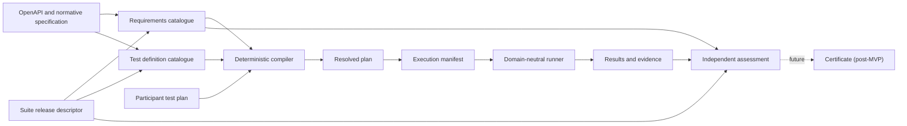

# Test Plan Architecture Migration Guide

> **Status: Accepted architecture record**
>
> **Decision date:** 2026-09-14
>
> This document is authoritative for the migration boundaries and decisions
> marked **Accepted** below. Items marked **Deferred**, **Superseded**, or
> **Compatibility only** are not part of the replacement architecture.

## Purpose

The conformance suite will migrate towards explicit, configuration-driven
artefacts with stable schemas and end-to-end traceability.

The governing principle is:

> Specification requirements, participant intent, compilation, execution, and
> assessment are separate concerns.

The runner executes an immutable manifest produced by a compiler. It does not
infer Open Banking obligations. The compiler resolves a participant plan
against trusted requirements and reusable test definitions.

This is a strangler migration. Existing behaviour is characterised before it
is replaced, new contracts are introduced alongside current code, one vertical
slice proves the architecture, consumers move behind compatibility adapters,
and superseded structures are removed last.

## Decision status

The status terms in this document have precise meanings:

| Status | Meaning |
| --- | --- |
| **Accepted** | Binding for the migration. A later change requires an explicit superseding decision. |
| **Deferred** | Intentionally undecided and owned by a named later layer. It must not be inferred by an earlier layer. |
| **Superseded** | Considered and rejected as a direction for the replacement architecture. |
| **Compatibility only** | Existing behaviour to characterise, not an accepted replacement contract or a promise to preserve it. |

## Terminology

| Term | Meaning |
| --- | --- |
| **Suite release descriptor** | OBL-authored document that binds compatible source artefacts, schemas, catalogues, tool releases, and content hashes. |
| **Requirements catalogue** | Standards/domain-authored rules describing obligations, conditionality, cardinality, normative references, and allowed configurable inputs. |
| **Test definition catalogue** | Test-author-authored reusable test cases, request bindings, assertions, dependencies, applicability, and covered requirement IDs. |
| **Participant test plan** | Participant intent: target release, declared implementation scope, environment configuration, and values for predefined inputs. |
| **Resolved plan** | Generated, inspectable explanation of how a participant plan was resolved against requirements and test definitions. |
| **Execution manifest** | Generated, immutable, runner-facing instructions containing only resolved executable work. |
| **Result and evidence** | Runner-generated observations, outcomes, safe evidence, and traceability identifiers. |
| **Certification assessment** | Independently calculated evaluation of completeness and eligibility against trusted requirements and release policy. |
| **Certificate** | Formal business artefact produced by the certification process; not an MVP runtime output. |
| **Security profile** | A protocol security profile such as FAPI 1 Advanced. In the current `1.0` plan, `specification.profile` has only this meaning. |
| **Requirements scope** | The Standards-owned functional scope against which obligations are resolved. AIS, PIS, CBPII, and VRP are currently exposed as resource/API families, not silently redefined as security profiles. |

Names used for target concepts in this document are architectural terms, not
accepted JSON property names unless a later schema decision says otherwise.

## Accepted architecture decisions

| ID | Decision | Rationale |
| --- | --- | --- |
| `TPA-001` | Requirements, participant intent, test definitions, resolved compilation, execution, results, and assessment are separate concerns and artefacts. | Prevents participant input, test implementation, and certification policy from becoming one mutable source of truth. |
| `TPA-002` | Requirements catalogues and test definition catalogues are separate. | A requirement is not a test; each side has different authorship, review, versioning, and reuse needs. |
| `TPA-003` | Participant-authored plans and generated execution manifests are separate. Participants do not author or edit resolved plans or execution manifests. | Prevents bypassing requirements validation and preserves provenance. |
| `TPA-004` | The runner is domain-neutral with respect to Open Banking obligation logic. | Obligation, applicability, and selection rules belong in trusted catalogues and the compiler. |
| `TPA-005` | Requirements are immutable within a selected suite release. Validation or a future execution policy may report or tolerate a participant-plan violation, but cannot weaken the requirement. | Keeps certification meaning stable and auditable. |
| `TPA-006` | OpenAPI is authoritative for the technical operation inventory, not for normative obligation. | OpenAPI supplies methods, paths, operation IDs, schemas, parameters, and security schemes; Standards-owned catalogues supply mandatory, conditional, and optional rules. |
| `TPA-007` | Every important object has a stable identifier, and coverage relationships are explicit. | Names and ordering are insufficient for durable requirement-to-evidence traceability. |
| `TPA-008` | Every new JSON artefact is versioned, strictly schema-validated, semantically validated, deterministic, and serialisable. Unknown properties fail unless the schema explicitly defines an extension point. | Avoids ambiguous configuration and makes fixtures, audit, and migration repeatable. |
| `TPA-009` | External JSON Schema is the structural authority for each new document version. Typed Python loading occurs only after structural validation and must not independently maintain duplicate structural rules. Cross-document and domain rules belong to semantic validators with stable diagnostics. | Establishes one schema authority while preserving typed runtime code. |
| `TPA-010` | New stable IDs are opaque ASCII identifiers, unique within their declared object kind and suite-release namespace. IDs must not be derived from display labels or array positions and must not be reused for changed semantics. | Supports stable references without making filenames or presentation text part of identity. |
| `TPA-011` | Suite release descriptors bind referenced artefacts by media type, schema version, logical ID, and `sha256:<lowercase-hex>` digest of the exact versioned bytes. A descriptor does not hash itself. | Makes release inputs deterministic and independently verifiable without a self-reference cycle. |
| `TPA-012` | Logical input ownership is split: requirements define which inputs are permitted or required; test definitions define technical request bindings; participant plans supply values; compilation records resolution. | Keeps test implementation details out of normative requirements and arbitrary request editing out of participant plans. |
| `TPA-013` | Requirements rules begin as a small, explicit, typed vocabulary. A general expression language is not introduced without concrete specification cases and a superseding decision. | Keeps validation reviewable and avoids premature language design. |
| `TPA-014` | Plan validity, permission to compile or execute, certification eligibility, individual test outcome, and overall conformance assessment are distinct facts. | A selected test can pass while the run remains incomplete or ineligible; an incomplete developer run is not automatically non-conformant. |
| `TPA-015` | Compiler output explains every inferred or explicit selection, applied rule, default, dependency, finding, and source artefact. Equivalent inputs and source bytes produce equivalent output apart from explicitly declared runtime-generated values. | Makes generated scope reviewable and reproducible. |
| `TPA-016` | The execution manifest contains resolved work only: exact instances and steps, order and dependencies, resolved input instructions, protocol/authentication instructions, assertions, evidence policy, and immutable provenance. | Keeps participant grammar, UI concepts, and obligation logic out of the runner. |
| `TPA-017` | Results carry the stable traceability chain from requirement to test definition, compiled instance, manifest step, and result observation. | Allows evidence and independent assessment to be tied back to trusted sources. |
| `TPA-018` | Certification assessment remains independent of participant-controlled compilation and execution inputs and uses trusted requirements plus approved-release policy. Certificate generation is deferred beyond MVP. | Preserves the current assurance boundary and avoids presenting local output as a formal certification decision. |
| `TPA-019` | Sensitive values never enter resolved-plan trace snapshots, execution-manifest provenance, persisted evidence, or safe exports. | Traceability must not create a credential disclosure path. |
| `TPA-020` | Existing behaviour is characterised before replacement; one representative vertical slice proves shared contracts before catalogue-family migration; legacy structures are deleted only after their consumers move. | Keeps every migration layer reviewable and the system operational. |
| `TPA-021` | The first walking skeleton is the Open Banking Read/Write v4.0 domestic standing-order flow: consent creation and retrieval, payment submission and retrieval, its dependency chain, and the predefined frequency input. Valid and invalid frequency fixtures are both required. | Exercises conditional scope, multiple endpoints, dependencies, reusable input binding, and positive/negative validation without migrating all PIS content. |
| `TPA-022` | Existing parity contracts remain the behavioural and provenance baseline until an explicit, reviewed compatibility decision replaces a behaviour. | Prevents the migration from silently dropping or normalising legacy coverage. |

### Stable traceability chain

```text
requirement ID
    |
    | covered by
    v
test definition ID
    |
    | selected and instantiated by compilation
    v
compiled test instance ID
    |
    | rendered as executable work
    v
manifest step ID
    |
    | produces
    v
result observation ID
```

One requirement may be covered by several tests. One test may provide evidence
for several requirements. These are explicit references, never naming
conventions.

## Artefact ownership and authority

| Artefact | Author/producer | Authority and responsibility |
| --- | --- | --- |
| Suite release descriptor | OBL release owner | Selects compatible, immutable input artefacts and records exact digests. It does not define requirement or test semantics itself. |
| Requirements catalogue | Standards/domain experts | Authoritative for normative obligations, conditionality, cardinality, allowed inputs, and normative references. |
| Test definition catalogue | Test authors | Authoritative for executable cases, request bindings, assertions, dependencies, applicability, and declared requirement coverage. |
| Participant test plan | Participant or builder | Authoritative only for participant intent and supplied values. It cannot redefine requirements or executable test definitions. |
| Resolved plan | Compiler | Authoritative record of resolution for one compilation. It is generated, inspectable, deterministic, and not participant-editable. |
| Execution manifest | Compiler | Authoritative runner input for one execution. It contains resolved instructions and immutable provenance, not unresolved domain rules. |
| Results/evidence | Runner | Authoritative record of observations made during that execution. It does not decide normative completeness by itself. |
| Certification assessment | Trusted validator | Authoritative assessment of completeness and eligibility against trusted requirements and release policy. |
| Certificate | Certification process | Formal business decision and artefact, deferred beyond MVP. |

Schema authority is per document version. The external schema owns structural
shape and constraints. Python loaders map a schema-valid document into immutable
types. Semantic validators own rules that require domain knowledge,
cross-document references, or comparison of values. A constraint must not be
implemented independently in both layers merely for convenience.

## Target flow



## Validity, execution, eligibility, and outcome

| Question | Concept |
| --- | --- |
| Does participant intent satisfy applicable requirements? | Plan or selection validity |
| May this selection be compiled and run under the active policy? | Compilation/execution permission |
| Could the evidence contribute to a certification submission? | Certification eligibility |
| Did an executable test satisfy its requirement? | Test outcome |
| Was the complete applicable scope assessed successfully? | Overall conformance assessment |

The accepted internal meanings are:

- **Certification-eligible**: the run has the required scope and evidence
  conditions to contribute to certification.
- **Not certification-eligible**: the run cannot support certification.
- **Conformant**: a complete eligible assessment passed its applicable
  requirements.
- **Non-conformant**: an applicable requirement was assessed and failed.
- **Not assessed overall**: insufficient applicable scope was executed to make
  an overall conformance judgement.
- **Passed**, **failed**, **skipped**, and **warned**: individual test or step
  outcomes.

Public product wording must continue to use **certification-ready** or
**locally validated**, not **certified**, unless the formal certification
process owns the statement.

## Compatibility decisions

These decisions describe how the migration treats the current system. They do
not promote current implementation details into target architecture.

| ID | Status | Current behaviour | Migration treatment |
| --- | --- | --- | --- |
| `TPC-001` | Compatibility only | `PlanDocumentV2` is the current participant-facing canonical JSON plan. | PR 1 characterises it. A later participant-plan layer decides adaptation and cutover. The `V2` Python name is not reserved as a target artefact name. |
| `TPC-002` | Compatibility only | `CANONICAL_TEST_PLAN_JSON_SCHEMA` is inline Python and some business data is structurally open. | It remains authoritative for current schema version `1.0`. PR 2 introduces external schema infrastructure for new document versions without silently changing `1.0`. |
| `TPC-003` | Compatibility only | `specification.profile` means a FAPI security profile. | Preserve that meaning while `1.0` is supported. It must not be reused for functional or requirements scope. Any new field name belongs to the participant-plan schema layer. |
| `TPC-004` | Deferred compatibility decision | Participant plans currently accept `executionMode` values `certification` and `development`. | This is an existing legacy field, not an accepted replacement concept. PR 1 characterises it. The later layer that owns execution policy decides whether to adapt, deprecate, or remove it. PR 0 makes no preservation promise. |
| `TPC-005` | Compatibility only | Read/Write execution adapts `CompiledTestPlan` into a synthetic legacy `Manifest`; DCR uses a separate adapter. | PR 5 must preserve observable behaviour through explicit adapters before either path can be removed. |
| `TPC-006` | Accepted risk boundary | Phase 1 reports are produced in participant-controlled environments and cannot prove authenticity. | Independent validation can establish consistency and readiness, not tamper resistance or formal certification. OBL-controlled provenance remains a Phase 2 concern. |
| `TPC-007` | Accepted corrections | The versioned Read/Write and DCR parity contracts list deliberate corrections to legacy behaviour. | Those ledgers are authoritative compatibility decisions. Unlisted observable deltas remain release blockers. |

## Deferred decisions and ownership

Deferred items are deliberately unavailable to earlier layers. An owning PR
must record the final decision before implementing the affected contract.

| ID | Deferred decision | Owning layer |
| --- | --- | --- |
| `TPD-001` | Final filenames and JSON property names not fixed by this record. | PR 2 for shared envelopes; PR 3-6 for their owned artefacts. |
| `TPD-002` | Exact typed requirements-rule wire vocabulary beyond the accepted small explicit rule set. | PR 3, proven by the standing-order skeleton. |
| `TPD-003` | Physical catalogue file partitioning. | PR 3, while preserving logical ownership and suite-release binding. |
| `TPD-004` | Exact participant-plan representation of requirements scope. | PR 4. It must not overload `specification.profile`. |
| `TPD-005` | Resolved-plan storage lifetime and participant-facing presentation. | PR 4 defines serialization; PR 8 owns participant surfaces. |
| `TPD-006` | Exact execution-manifest schema and runtime-generated instruction vocabulary. | PR 5. |
| `TPD-007` | Final public assessment terminology beyond the existing certification-ready assurance boundary. | PR 6 with Product, Standards, and Certification review. |
| `TPD-008` | Backwards-compatibility duration and removal policy for current plans, results, and adapters. | The layer changing each public surface; final removals in PR 9. |
| `TPD-009` | Whether any future developer policy can permit compilation of invalid partial selections, and where that policy is requested. | Post-MVP architecture decision. |
| `TPD-010` | Certificate generation, signing, and issuance. | Post-MVP certification process. |

## Superseded proposals

The following proposals are not accepted and must not appear in earlier
migration layers:

- participant-authored or participant-editable execution manifests;
- arbitrary participant `requestOverrides` or JSON Pointer request editing;
- a `developmentOverrides` object;
- disabling or mutating requirements in developer mode;
- reusing `specification.profile` for a functional requirements scope;
- a generic expression language before explicit rule forms prove insufficient;
- deriving stable IDs from display labels, filenames, or array order;
- inferring requirement coverage from test names;
- treating an incomplete developer run as proof of non-conformance; and
- treating a locally generated passing report as an automated certification
  decision or proof of authenticity.

## Migration sequence

Each PR is a separate layer. A layer must not introduce concepts owned by a
later PR.

### PR 0: architecture record

This document is the deliverable. No replacement code, schema, or catalogue
content belongs in this layer.

Exit gate:

- artefact responsibilities and authorities are explicit;
- accepted, compatibility-only, deferred, and superseded decisions are
  distinguishable;
- terminology collisions are recorded; and
- developer-mode and certificate concerns are explicitly deferred.

### PR 1: current pipeline characterisation

Add golden tests without changing production behaviour. Freeze representative
participant-plan parsing, catalogue selection, endpoint/capability
applicability, dependency expansion, business-data mapping, synthetic manifest
generation, result traceability, and eligibility. Cover the accepted PIS
standing-order journey plus representative AIS and DCR paths. Record suspicious
behaviour as compatibility findings rather than normalising it.

### PR 2: shared configuration contracts

Introduce versioned external schemas, common document envelopes, stable IDs,
immutable typed loading, structured diagnostics with stable codes and instance
paths, provenance, and suite-release metadata. Do not migrate current
consumers or catalogue content.

### PR 3: requirements and test-definition walking skeleton

Model only the accepted Read/Write v4.0 domestic standing-order slice. Keep
requirements and tests separate, give every test explicit covered requirement
IDs, separate logical inputs from request bindings, and validate references.
Preserve the current runtime path.

### PR 4: participant plan and resolved compiler

Introduce the new participant-plan contract and deterministic resolved-plan
compiler for the walking skeleton. Infer required scope, evaluate the accepted
typed rules, resolve predefined inputs, expand dependencies, preserve findings
and provenance, and adapt to the current compiled execution path. Do not add
developer-mode selection or override syntax.

### PR 5: execution-manifest boundary

Generate an immutable execution manifest from the resolved plan and adapt the
existing runtime to consume it. Do not redesign HTTP, OAuth, PSU, JWS,
scheduling, or evidence behaviour. Preserve Read/Write and DCR through explicit
compatibility adapters.

### PR 6: result and assessment traceability

Connect results to suite release, requirements, test definitions, compiled
instances, manifest steps, safe participant-plan snapshot, and compiler
findings. Keep independent certification assessment and do not implement
certificate generation.

### PR 7: catalogue-family migration

After the contracts and walking skeleton are accepted, migrate PIS, AIS,
CBPII, VRP, and DCR independently. Family work owns only its catalogue
directory and fixtures. A coordinator-owned change integrates the central
release registry.

### PR 8: participant surface cutover

Move browser, CLI, REST, import/export, and review surfaces to the accepted
participant-plan and resolved-plan contracts. Builder choices come from trusted
catalogues, and review surfaces explain inferences and findings.

### PR 9: legacy removal

Remove only structures with no remaining consumers. The change should be
primarily deletion. Remaining compatibility code must identify its consumer and
retention reason.

## Rules for every implementation layer

- Preserve a working system throughout the migration.
- Read this record and all later accepted decisions before editing.
- Keep new artefacts versioned, deterministic, traceable, and backed by valid
  and invalid golden fixtures.
- Add targeted unit coverage and a component proof when a layer reaches an
  existing boundary.
- Validate unknown properties, broken references, and invalid identifiers
  explicitly.
- Preserve sensitive-value masking and the independent assessment boundary.
- Record intentional behaviour changes as compatibility decisions with tests.
- Stop on terminology, ownership, or schema-authority conflict; do not create a
  second source of truth to work around it.
- Do not reduce existing parity or coverage without an explicit reviewed
  decision.

## Handoff record

Every layer handoff states:

```text
PR layer completed
accepted contracts and invariants
files and schemas introduced
compatibility adapters still active
golden fixtures proving behaviour
known gaps
explicitly deferred work
the exact next PR boundary
```

